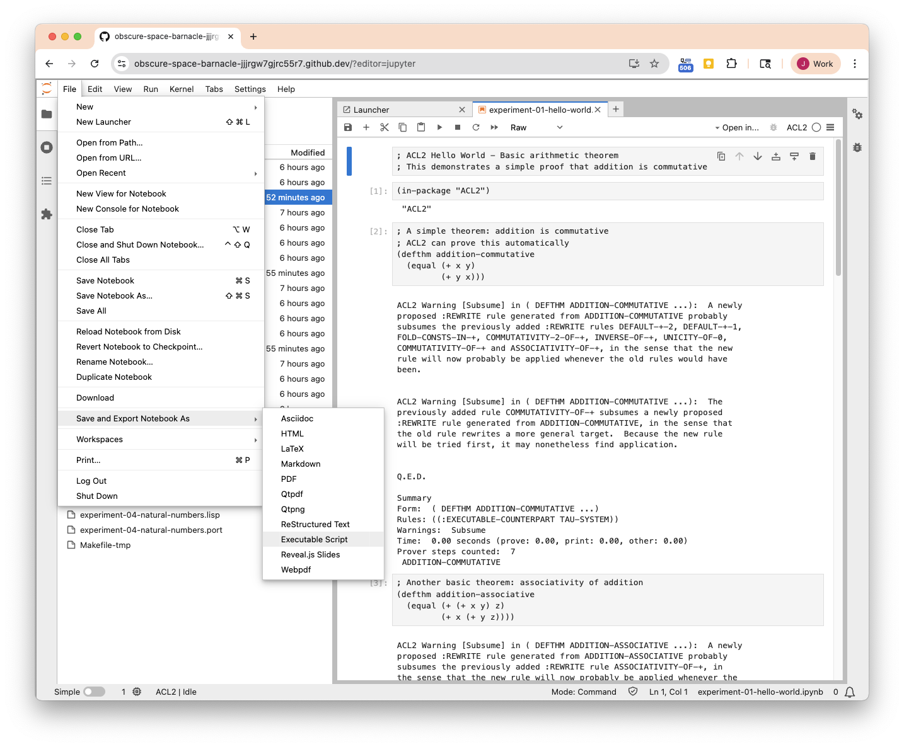

# ACL2 Experiments

A collection of theorem-proving experiments using the [ACL2](https://www.cs.utexas.edu/~moore/acl2/) automated reasoning system. This repository focuses on fundamental theorems from [Software Foundations](https://softwarefoundations.cis.upenn.edu/), adapted from Coq to ACL2.

## Project Goals

- Work through core theorems from Software Foundations Volume 1 (Logical Foundations)
- Explore ACL2's proof automation capabilities
- Document proof techniques and patterns for future reference
- Build a library of reusable lemmas and proof strategies

## Current Progress

**Completed Chapters:**
- ✅ Chapter 2: Basics (arithmetic properties)
- ✅ Chapter 3: Induction (inductive proofs)
- ✅ Chapter 4: Lists (list operations and properties)
- ✅ Chapter 5: Polymorphism (higher-order functions: map, filter, fold)

**Total Theorems Proved:** 50+

See [notes/swf-progression-plan.md](notes/swf-progression-plan.md) for detailed roadmap.

## Structure

```
experiments/
├── arithmetic/     Arithmetic theorems and custom nat encoding
├── lists/         List operations, reverse, append, higher-order functions
├── logic/         (planned) Logical connectives and reasoning
└── data-structures/ (planned) Maps and other data structures

utils/             Shared utility functions and lemmas
notes/             Documentation and lessons learned
```

## Key Proof Techniques Demonstrated

- **Selective Theory Control**: Managing ACL2's rewriter with `:in-theory (e/d ...)`
- **Helper Lemmas**: Building proof support for underlying function definitions (e.g., `revappend`)
- **Avoiding Rewrite Loops**: Strategic use of `:in-theory (disable ...)`
- **Custom Data Structures**: Encoding Peano naturals with correctness proofs

See [notes/lessons-learned.md](notes/lessons-learned.md) for detailed examples.

## Highlighted Experiments

- **[fold-product-append](experiments/lists/experiment-02-higher-order-product.lisp)**: Advanced proof requiring selective theory control to manage arithmetic rewriting
- **[Natural numbers encoding](experiments/arithmetic/experiment-04-natural-numbers.lisp)**: Cons-based Peano naturals with correctness theorems
- **[List reverse theorems](experiments/lists/experiment-01-list-basics.lisp)**: Working with ACL2's `revappend` representation

## Getting Started

### Prerequisites

Install ACL2 (available via Homebrew on macOS, or from source):
```bash
brew install acl2
```

### Running Experiments

Start ACL2 REPL:
```bash
acl2
```

Load an experiment:
```lisp
(include-book "experiments/lists/experiment-01-list-basics")
```

### Certifying Books (verify/prove all theorems)

Use the ACL2 [`cert.pl`](https://acl2.org/doc/?topic=BUILD____CERT.PL) script to certify (verify all proofs) one book.
```bash
cert.pl experiments/lists/experiment-01-list-basics.lisp
```

Use the Makefile to certify ACL2 books:

```bash
# Certify all out-of-date books
make certify

# Check which books need certification
make check-cert

# Certify a specific book
make experiments/lists/experiment-01-list-basics.cert

# Remove certification files (*.cert, .port, .fasl)
make clean-cert
```

The Makefile automatically handles dependencies (e.g., `include-book` statements) and only recertifies books when the source `.lisp` file is newer than the `.cert` file.

### Working with Jupyter Notebooks

The `.lisp` files can be viewed and edited as Jupyter notebooks (`.ipynb`). Use the Makefile to keep notebooks in sync:

```bash
# Convert all updated .lisp files to .ipynb
make

# Check which notebooks need updating
make check

# Show status of all notebooks
make list
```

See [utils/README_CONVERTER.md](utils/README_CONVERTER.md) for detailed converter documentation.

#### Save notebook to executable script (.ipynb to .lisp)
You can use the JupyterLab "File > Save & Export ... > As Executable Script" command to save a notebook as a .lisp file.

 Save & Export ... > As Executable Script' menu screenshot" width="25%">

### Running ACL2 and Jupyter with prebuilt Docker image

.devcontainer/devcontainer.json is configured to run ghcr.io/jimwhite/acl2-jupyter:latest which is built by https://github.com/jimwhite/acl2-jupyter.

Detailed how to instructions for running in GitHub Codespaces (for free!) are at https://github.com/jimwhite/acl2-jupyter?tab=readme-ov-file#using-a-prebuilt-image-in-a-github-codespace-free


## Resources

- [ACL2 Homepage](https://www.cs.utexas.edu/~moore/acl2/)
- [ACL2 Manual](https://www.cs.utexas.edu/users/moore/acl2/manuals/current/manual/)
- [Software Foundations](https://softwarefoundations.cis.upenn.edu/lf-current/)
- [Quick Reference](notes/acl2-quick-reference.md) - Local guide to common ACL2 patterns
- [ACL2-Jupyter Docker Image](https://github.com/jimwhite/acl2-jupyter) - GitHub project that builds the image for the devcontainer

## License

BSD 3-Clause License - see [LICENSE](LICENSE) file for details.
